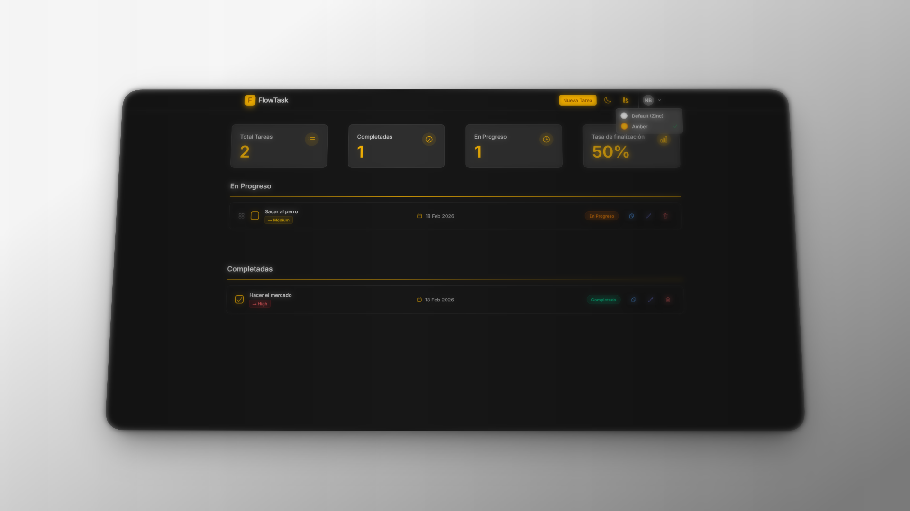
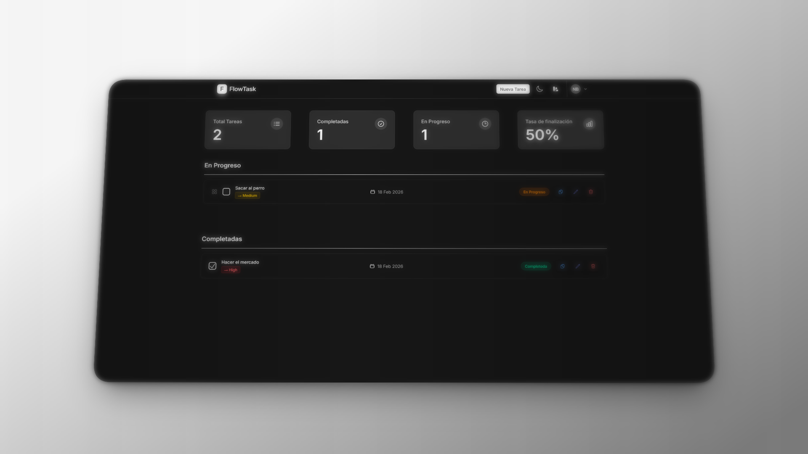
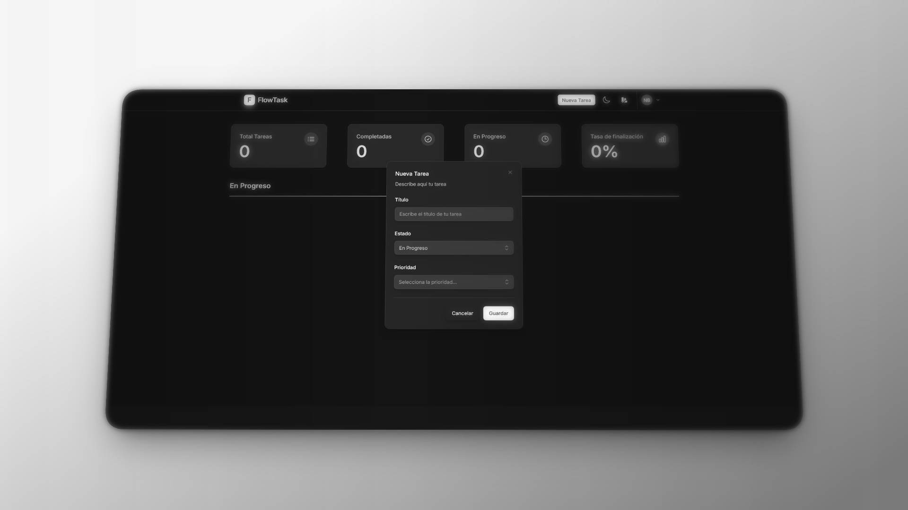
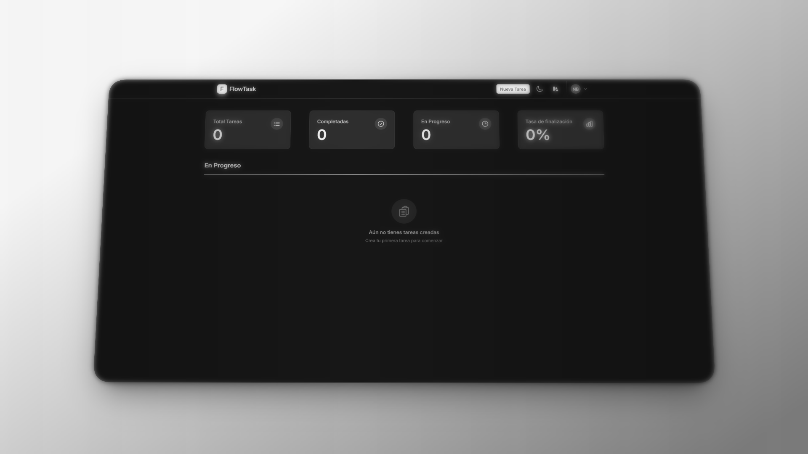
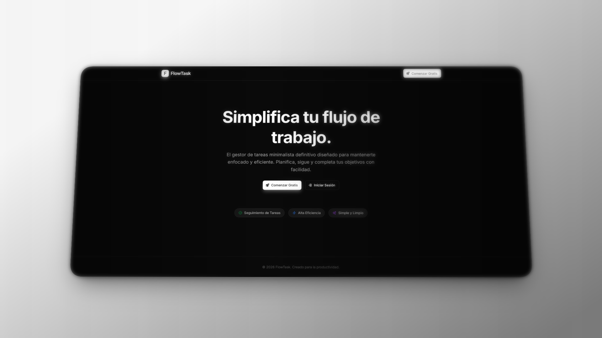

# FlowTask

> Gestor de tareas minimalista, moderno y eficiente.

FlowTask es una aplicación de gestión de tareas construida con **Laravel**, **Livewire** y **Flux**. Diseñada para mantenerte enfocado y productivo con una interfaz limpia e intuitiva.



---

## ✨ Características

- **Gestión de Tareas** — Crea, edita y organiza tus tareas con facilidad
- **Diseño Minimalista** — Interfaz limpia y sin distracciones
- **Dark Mode** — Soporte completo para tema oscuro
- **Autenticación** — Sistema de registro e inicio de sesión integrado
- **Tiempo Real** — Actualizaciones instantáneas con Livewire

---

## 🛠️ Tech Stack

<div align="center">


</div>

---

## 📸 Preview

<div align="center">

| Dashboard | Tareas | Edición |
|:---:|:---:|:---:|
|  |  |  |

| Login | Registro |
|:---:|:---:|
|  |  |

</div>

---

## 🚀 Instalación

```bash
# Clonar el repositorio
git clone https://github.com/tu-usuario/flowtask.git
cd flowtask

# Instalar dependencias
composer install
npm install

# Configurar entorno
cp .env.example .env
php artisan key:generate

# Ejecutar migraciones
php artisan migrate

# Iniciar servidor
php artisan serve
npm run dev
```

---

## 📄 Licencia

MIT License © 2026 FlowTask
